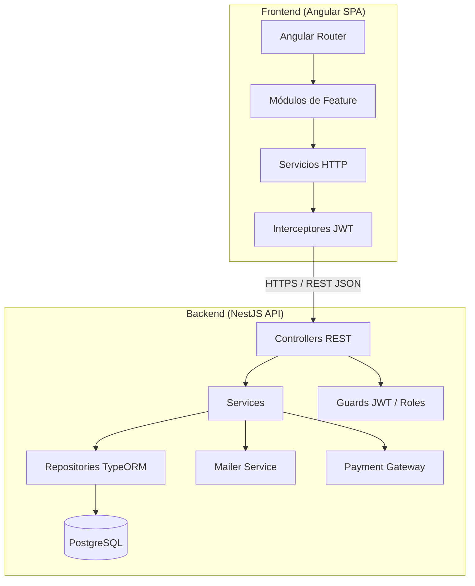

# Documento de Diseño Técnico — Vivero Online

## Visión General

Vivero Online es una aplicación web de comercio electrónico para la venta de plantas. La arquitectura sigue un modelo cliente-servidor desacoplado: un frontend SPA en **Angular** que consume una API REST construida con **NestJS**. La persistencia se gestiona con **PostgreSQL** a través de **TypeORM**.

El sistema soporta tres tipos de actores: Visitante (no autenticado), Usuario (autenticado) y Administrador. La autenticación se basa en JWT con refresh tokens. El acceso a rutas protegidas se controla mediante guards en Angular (frontend) y guards + decoradores de roles en NestJS (backend).

---

## Arquitectura



### Decisiones de arquitectura

- **Angular standalone components** (Angular 17+): reduce boilerplate de módulos.
- **NestJS modular**: cada dominio (plants, orders, auth, users, categories) es un módulo independiente.
- **TypeORM** con migraciones versionadas para control de esquema.
- **JWT** (access token 15 min + refresh token 7 días) almacenado en `httpOnly` cookies para mitigar XSS.
- **Sesión inactiva**: el frontend detecta inactividad de 30 min y llama al endpoint de logout.
- **Soft delete** en plantas para preservar historial de pedidos (requisito 6.3).

---

## Componentes e Interfaces

### Frontend Angular

| Módulo | Componentes principales | Ruta |
|---|---|---|
| `CatalogModule` | `PlantListComponent`, `PlantDetailComponent`, `PlantFilterComponent` | `/catalog`, `/catalog/:id` |
| `AuthModule` | `LoginComponent`, `RegisterComponent`, `ResetPasswordComponent` | `/auth/*` |
| `CartModule` | `CartComponent`, `CartItemComponent` | `/cart` |
| `CheckoutModule` | `CheckoutComponent`, `OrderConfirmationComponent` | `/checkout` |
| `OrdersModule` | `OrderListComponent`, `OrderDetailComponent` | `/orders`, `/orders/:id` |
| `AdminModule` | `AdminPlantFormComponent`, `AdminOrderListComponent`, `AdminCategoryComponent` | `/admin/*` |

**Servicios Angular:**

```typescript
// Contratos de los servicios principales
interface PlantService {
  getPlants(filters?: PlantFilters): Observable<PagedResult<Plant>>;
  getPlantById(id: string): Observable<Plant>;
}

interface CartService {
  addItem(plantId: string, qty: number): void;
  removeItem(plantId: string): void;
  updateQty(plantId: string, qty: number): void;
  getCart(): CartState;
  clear(): void;
}

interface AuthService {
  login(credentials: LoginDto): Observable<void>;
  register(data: RegisterDto): Observable<void>;
  logout(): Observable<void>;
  refreshToken(): Observable<void>;
  currentUser$: Observable<User | null>;
}

interface OrderService {
  createOrder(checkout: CheckoutDto): Observable<Order>;
  getMyOrders(): Observable<Order[]>;
  getOrderById(id: string): Observable<Order>;
}
```

**Guards Angular:**

- `AuthGuard`: redirige a `/auth/login` si no hay sesión activa.
- `RoleGuard`: redirige a `/` si el usuario no tiene rol `admin`.
- `InactivityGuard`: servicio que monitorea eventos del DOM y dispara logout tras 30 min.

### Backend NestJS

**Módulos:**

| Módulo | Responsabilidad |
|---|---|
| `AuthModule` | Registro, login, refresh, reset de contraseña, JWT strategy |
| `UsersModule` | CRUD de usuarios, gestión de roles |
| `PlantsModule` | CRUD de plantas, búsqueda, filtrado, soft delete |
| `CategoriesModule` | CRUD de categorías |
| `CartModule` | Lógica de carrito (en memoria / sesión o persistido por usuario) |
| `OrdersModule` | Creación de pedidos, cambio de estado, historial |
| `PaymentsModule` | Integración con pasarela de pago (Stripe u equivalente) |
| `MailModule` | Envío de emails transaccionales (confirmación, reset, estado de pedido) |

**Endpoints REST principales:**

```
GET    /plants                  → listado con filtros y paginación
GET    /plants/:id              → detalle de planta
POST   /plants                  → crear planta (admin)
PATCH  /plants/:id              → actualizar planta (admin)
DELETE /plants/:id              → soft delete (admin)

GET    /categories              → listar categorías
POST   /categories              → crear categoría (admin)
PATCH  /categories/:id          → renombrar (admin)
DELETE /categories/:id          → desactivar (admin)

POST   /auth/register           → registro
POST   /auth/login              → login → JWT cookie
POST   /auth/logout             → logout
POST   /auth/refresh            → refresh token
POST   /auth/forgot-password    → solicitar reset
POST   /auth/reset-password     → confirmar reset

GET    /cart                    → obtener carrito del usuario
POST   /cart/items              → añadir ítem
PATCH  /cart/items/:plantId     → actualizar cantidad
DELETE /cart/items/:plantId     → eliminar ítem

POST   /orders                  → crear pedido (checkout)
GET    /orders/me               → historial del usuario
GET    /orders/:id              → detalle de pedido
GET    /orders                  → todos los pedidos (admin)
PATCH  /orders/:id/status       → cambiar estado (admin)
```

---

## Modelos de Datos

### Entidades TypeORM

```typescript
@Entity()
export class User {
  @PrimaryGeneratedColumn('uuid') id: string;
  @Column({ unique: true }) email: string;
  @Column() passwordHash: string;
  @Column({ type: 'enum', enum: UserRole, default: UserRole.USER }) role: UserRole;
  @Column({ default: false }) emailVerified: boolean;
  @CreateDateColumn() createdAt: Date;
  @OneToMany(() => Order, o => o.user) orders: Order[];
}

@Entity()
export class Category {
  @PrimaryGeneratedColumn('uuid') id: string;
  @Column() name: string;
  @Column({ default: true }) active: boolean;
  @OneToMany(() => Plant, p => p.category) plants: Plant[];
}

@Entity()
export class Plant {
  @PrimaryGeneratedColumn('uuid') id: string;
  @Column() name: string;
  @Column('text') description: string;
  @Column('text') careInstructions: string;
  @Column('decimal', { precision: 10, scale: 2 }) price: number;
  @Column('int') stock: number;
  @Column() imageUrl: string;
  @Column({ default: true }) active: boolean;          // soft delete
  @ManyToOne(() => Category, c => c.plants) category: Category;
  @CreateDateColumn() createdAt: Date;
  @UpdateDateColumn() updatedAt: Date;
}

@Entity()
export class Order {
  @PrimaryGeneratedColumn('uuid') id: string;
  @ManyToOne(() => User, u => u.orders) user: User;
  @OneToMany(() => OrderItem, i => i.order, { cascade: true }) items: OrderItem[];
  @Column({ type: 'enum', enum: OrderStatus, default: OrderStatus.PENDING }) status: OrderStatus;
  @Column('jsonb') shippingAddress: ShippingAddress;
  @Column('decimal', { precision: 10, scale: 2 }) total: number;
  @CreateDateColumn() createdAt: Date;
  @UpdateDateColumn() updatedAt: Date;
}

@Entity()
export class OrderItem {
  @PrimaryGeneratedColumn('uuid') id: string;
  @ManyToOne(() => Order, o => o.items) order: Order;
  @ManyToOne(() => Plant) plant: Plant;
  @Column('int') quantity: number;
  @Column('decimal', { precision: 10, scale: 2 }) unitPrice: number;
}
```

**Enums:**

```typescript
enum UserRole { USER = 'user', ADMIN = 'admin' }

enum OrderStatus {
  PENDING      = 'Pendiente',
  CONFIRMED    = 'Confirmado',
  PREPARING    = 'En preparación',
  SHIPPED      = 'Enviado',
  DELIVERED    = 'Entregado',
}
```

**DTOs relevantes:**

```typescript
interface PlantFilters {
  categoryId?: string;
  search?: string;       // busca en name y description
  page?: number;
  limit?: number;
}

interface CheckoutDto {
  shippingAddress: ShippingAddress;
  paymentMethodId: string;   // token de Stripe
}

interface ShippingAddress {
  street: string;
  city: string;
  postalCode: string;
  country: string;
}
```


---

## Propiedades de Corrección

*Una propiedad es una característica o comportamiento que debe cumplirse en todas las ejecuciones válidas del sistema — esencialmente, una declaración formal sobre lo que el sistema debe hacer. Las propiedades sirven de puente entre las especificaciones legibles por humanos y las garantías de corrección verificables automáticamente.*

### Propiedad 1: Completitud de datos de planta en catálogo y detalle

*Para cualquier* planta activa en el sistema, tanto el listado del catálogo como la ficha de detalle deben incluir nombre, imagen, precio, disponibilidad, descripción, instrucciones de cuidado, categoría y stock.

**Validates: Requirements 1.1, 1.2**

---

### Propiedad 2: Filtrado por categoría es exhaustivo y exclusivo

*Para cualquier* categoría C y cualquier colección de plantas, aplicar el filtro por C debe devolver exactamente las plantas cuya categoría sea C — ni más ni menos.

**Validates: Requirements 1.3**

---

### Propiedad 3: Búsqueda por término es inclusiva

*Para cualquier* término de búsqueda T y cualquier colección de plantas, todos los resultados devueltos deben contener T en su nombre o descripción, y ninguna planta que contenga T debe quedar excluida.

**Validates: Requirements 1.4**

---

### Propiedad 4: Plantas agotadas no son añadibles al carrito

*Para cualquier* planta con stock = 0, el sistema debe marcarla como "Agotada" y rechazar cualquier intento de añadirla al carrito.

**Validates: Requirements 1.5**

---

### Propiedad 5: Round-trip de autenticación

*Para cualquier* par email/contraseña válido, registrar un usuario y luego iniciar sesión con esas credenciales debe devolver una sesión activa. Intentar iniciar sesión con credenciales incorrectas debe devolver siempre el mismo mensaje de error genérico, independientemente de qué campo sea incorrecto.

**Validates: Requirements 2.1, 2.3, 2.4**

---

### Propiedad 6: Unicidad de email en registro

*Para cualquier* email ya registrado en el sistema, un segundo intento de registro con ese mismo email debe ser rechazado con un error de duplicado.

**Validates: Requirements 2.2**

---

### Propiedad 7: Validez temporal del token de reset de contraseña

*Para cualquier* solicitud de recuperación de contraseña, el token generado debe tener una fecha de expiración igual a la fecha de creación más 60 minutos. Un token con fecha de expiración pasada debe ser rechazado.

**Validates: Requirements 2.5, 2.6 (edge-case)**

---

### Propiedad 8: Invariante de totales del carrito

*Para cualquier* estado del carrito, se deben cumplir simultáneamente: (a) añadir una planta incrementa su cantidad en 1; (b) el subtotal de cada ítem es siempre cantidad × precio unitario; (c) el total del carrito es la suma de todos los subtotales más impuestos; (d) eliminar un ítem lo remueve del carrito y recalcula el total correctamente.

**Validates: Requirements 3.1, 3.2, 3.3, 3.4**

---

### Propiedad 9: Límite de cantidad por stock disponible

*Para cualquier* planta con stock S y cualquier cantidad Q > S solicitada, el sistema debe limitar la cantidad en el carrito a S.

**Validates: Requirements 3.5**

---

### Propiedad 10: Confirmación de pedido reduce stock

*Para cualquier* pedido válido con N unidades de una planta con stock S, confirmar el pedido debe resultar en stock_nuevo = S − N, y el pedido debe tener estado inicial "Pendiente" con un identificador único.

**Validates: Requirements 4.2, 4.4**

---

### Propiedad 11: Pago rechazado preserva el carrito

*Para cualquier* intento de checkout con pago rechazado, el estado del carrito después del rechazo debe ser idéntico al estado antes del intento.

**Validates: Requirements 4.3**

---

### Propiedad 12: Historial de pedidos ordenado por fecha descendente

*Para cualquier* usuario con N pedidos, la lista devuelta por el endpoint de historial debe contener exactamente N pedidos ordenados por `createdAt` de forma descendente.

**Validates: Requirements 5.1, 7.1**

---

### Propiedad 13: Notificación por email en cambio de estado

*Para cualquier* pedido y cualquier transición de estado válida, el servicio de email debe ser invocado exactamente una vez con el nuevo estado y los datos del usuario propietario del pedido.

**Validates: Requirements 5.3, 7.2**

---

### Propiedad 14: Estados de pedido válidos y rechazo de inválidos

*Para cualquier* string que no sea uno de los cinco estados definidos ("Pendiente", "Confirmado", "En preparación", "Enviado", "Entregado"), el sistema debe rechazar la operación de cambio de estado.

**Validates: Requirements 5.4, 7.3**

---

### Propiedad 15: Round-trip de CRUD de plantas

*Para cualquier* conjunto de datos válidos de planta, crear la planta y luego consultarla debe devolver los mismos datos. Actualizar precio o stock y volver a consultar debe reflejar los nuevos valores. Hacer soft-delete debe excluir la planta del catálogo pero preservar los pedidos que la referencian.

**Validates: Requirements 6.1, 6.2, 6.3**

---

### Propiedad 16: Rechazo de stock negativo

*Para cualquier* valor entero negativo N, intentar establecer el stock de una planta a N debe ser rechazado por el sistema.

**Validates: Requirements 6.4**

---

### Propiedad 17: Round-trip de CRUD de categorías

*Para cualquier* nombre de categoría válido, crear la categoría y consultarla debe devolverla activa. Renombrarla y consultarla debe reflejar el nuevo nombre. Desactivarla debe excluirla de la lista de categorías activas.

**Validates: Requirements 6.5**

---

### Propiedad 18: Control de acceso basado en roles

*Para cualquier* request no autenticado a endpoints protegidos (carrito, checkout, historial de pedidos), el sistema debe responder con HTTP 401. *Para cualquier* request autenticado sin rol `admin` a endpoints de administración, el sistema debe responder con HTTP 403.

**Validates: Requirements 8.1, 8.2**

---

### Propiedad 19: Contraseñas almacenadas como hash bcrypt

*Para cualquier* usuario registrado, el campo `passwordHash` almacenado nunca debe ser igual al texto plano de la contraseña, y debe ser un hash bcrypt válido (verificable con `bcrypt.compare`).

**Validates: Requirements 8.3**

---

## Manejo de Errores

### Estrategia general

- Todos los errores del backend se devuelven en formato JSON estándar: `{ statusCode, message, error }`.
- NestJS `ExceptionFilter` global captura excepciones no controladas y devuelve HTTP 500 sin exponer stack traces en producción.
- El frontend Angular usa un `HttpInterceptor` global para capturar errores HTTP y mostrar notificaciones al usuario.

### Casos de error específicos

| Escenario | Código HTTP | Comportamiento |
|---|---|---|
| Email duplicado en registro | 409 Conflict | Mensaje: "El email ya está registrado" |
| Credenciales incorrectas | 401 Unauthorized | Mensaje genérico (no revela qué campo) |
| Token JWT expirado | 401 Unauthorized | Frontend intenta refresh; si falla, redirige a login |
| Token de reset expirado | 400 Bad Request | Mensaje con opción de solicitar nuevo enlace |
| Stock insuficiente en checkout | 409 Conflict | Notifica al usuario, carrito intacto |
| Pago rechazado | 402 Payment Required | Mensaje descriptivo del proveedor, carrito intacto |
| Stock negativo | 422 Unprocessable Entity | Mensaje de validación |
| Estado de pedido inválido | 422 Unprocessable Entity | Lista de estados válidos en la respuesta |
| Recurso no encontrado | 404 Not Found | Mensaje estándar |
| Acceso sin autenticación | 401 Unauthorized | Redirige a login en frontend |
| Acceso sin rol admin | 403 Forbidden | Redirige a home en frontend |

### Validación de entrada

- Backend: `class-validator` + `ValidationPipe` global en NestJS para validar todos los DTOs.
- Frontend: validación reactiva en Angular con `Validators` del módulo `ReactiveFormsModule`.

---

## Estrategia de Testing

### Enfoque dual: tests unitarios + tests basados en propiedades

Los tests unitarios verifican ejemplos concretos, casos límite y condiciones de error. Los tests basados en propiedades verifican propiedades universales sobre rangos amplios de entradas generadas aleatoriamente. Ambos son complementarios y necesarios.

### Tests unitarios (NestJS — Jest)

- Un test por caso de uso principal de cada servicio.
- Mocks de repositorios TypeORM con `@nestjs/testing`.
- Tests de integración con base de datos en memoria (SQLite) para flujos críticos (checkout, cambio de estado).
- Foco en: ejemplos concretos, casos límite (stock=0, carrito vacío, token expirado), condiciones de error.
- Evitar duplicar cobertura que ya proveen los tests de propiedades.

### Tests basados en propiedades (fast-check — TypeScript)

Se usa **fast-check** como librería de property-based testing. Cada test debe ejecutar un mínimo de **100 iteraciones**.

Cada test de propiedad debe incluir un comentario de trazabilidad:
`// Feature: online-plant-nursery, Property N: <texto de la propiedad>`

| Propiedad | Test de propiedad |
|---|---|
| P2: Filtrado por categoría | `fc.property(fc.array(arbPlant), arbCategory, ...)` |
| P3: Búsqueda por término | `fc.property(fc.string(), fc.array(arbPlant), ...)` |
| P4: Plantas agotadas | `fc.property(arbPlantWithZeroStock, ...)` |
| P5: Round-trip auth | `fc.property(arbValidCredentials, ...)` |
| P6: Unicidad de email | `fc.property(arbEmail, ...)` |
| P7: Validez token reset | `fc.property(arbDate, ...)` |
| P8: Invariante carrito | `fc.property(arbCartState, arbPlant, ...)` |
| P9: Límite por stock | `fc.property(arbPlantWithStock, fc.integer({ min: 1 }), ...)` |
| P10: Confirmación reduce stock | `fc.property(arbValidOrder, ...)` |
| P11: Pago rechazado preserva carrito | `fc.property(arbCartState, ...)` |
| P12: Historial ordenado | `fc.property(fc.array(arbOrder, { minLength: 1 }), ...)` |
| P14: Estados inválidos rechazados | `fc.property(fc.string().filter(s => !isValidStatus(s)), ...)` |
| P15: Round-trip CRUD plantas | `fc.property(arbValidPlantData, ...)` |
| P16: Stock negativo rechazado | `fc.property(fc.integer({ max: -1 }), ...)` |
| P17: Round-trip CRUD categorías | `fc.property(arbCategoryName, ...)` |
| P18: Control de acceso | `fc.property(arbProtectedRoute, arbUserRole, ...)` |
| P19: Hash bcrypt | `fc.property(arbPassword, ...)` |

### Tests E2E (Cypress — Angular)

- Flujo completo de compra: registro → catálogo → carrito → checkout → confirmación.
- Flujo de administración: login admin → crear planta → actualizar stock → cambiar estado de pedido.
- Verificación de redirecciones de acceso (visitante intenta acceder a carrito).
