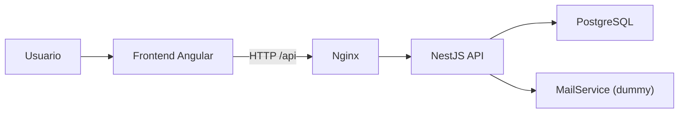

# Vivero Online


> Un e-commerce de plantas con alma de producto real: Angular al frente, NestJS detrás, PostgreSQL en el corazón y bastante espacio todavía para endurecerlo y hacerlo crecer.

Aplicación full-stack para gestión y venta online de plantas, construida como monorepo con Angular en frontend, NestJS en backend y PostgreSQL como persistencia principal.

La idea del proyecto está muy bien parada: una base moderna, legible y extensible para un vertical commerce. La implementación actual ya muestra criterio técnico, autenticación funcional y contenedorización lista para desarrollo, aunque todavía mantiene áreas mockeadas y varios puntos de madurez pendientes antes de hablar de producción real.

---

## 🌿 De Un Vistazo

- Arquitectura actual: monorepo modular, no microservicios.
- Frontend: Angular 17 con standalone components, lazy loading y Tailwind CSS.
- Backend: NestJS 10, TypeORM, PostgreSQL, DTOs con validación y autenticación JWT por cookies `HttpOnly`.
- Infraestructura local: Docker Compose con `postgres`, `backend` y `frontend`.
- Estado funcional: autenticación y base de catálogo implementadas; carrito, checkout, órdenes y parte del admin siguen más cerca de un prototipo funcional que de un flujo cerrado end-to-end.

---

## ✨ Qué Tiene Hoy

### ✅ Lo que ya está bien encaminado

- Monorepo con workspaces `frontend` y `backend`.
- API REST de autenticación con registro, login, refresh, logout y reset de contraseña.
- Módulos backend para usuarios, plantas y categorías.
- Validación global de entrada con `ValidationPipe`.
- CORS y cookies `HttpOnly` para sesión.
- Frontend Angular con rutas lazy-loaded para catálogo, auth, carrito, checkout, órdenes y administración.
- Dockerfiles multi-stage para frontend y backend.
- Pipeline CI con tests y builds básicos.

### 🧪 Lo que todavía está parcial o mockeado

- Catálogo frontend usando `MOCK_PLANTS` en lugar de consumir la API real.
- Carrito sin estado persistente ni servicio compartido.
- Checkout sin integración con órdenes, pagos ni backend.
- Módulo de órdenes ausente en backend.
- Panel admin principalmente visual, sin flujo CRUD completo conectado.
- Servicio de correo de recuperación de contraseña simulado por logs.

### 🎯 Cómo conviene posicionarlo

Muy buen proyecto para portfolio técnico, evolución guiada o base de MVP. Todavía no conviene venderlo como plataforma production-ready sin cerrar primero varios temas de seguridad operativa, consistencia funcional y observabilidad.

---

## 🏗️ Arquitectura



### Frontend

- SPA Angular 17.
- `standalone components` y routing dividido por dominios.
- Lazy loading para `catalog`, `cart`, `checkout`, `orders`, `admin` y `auth`.
- Estilos globales con Tailwind CSS y utilidades propias en `styles.css`.
- Nginx sirve el build estático y puede proxyear `/api/` al backend.

### Backend

- Aplicación NestJS monolítica modular.
- Módulos principales: `auth`, `users`, `plants`, `categories`, `mail`.
- TypeORM como capa de persistencia.
- PostgreSQL 15 como base de datos principal.
- Exposición bajo prefijo global `/api`.

### Estructura del repositorio

```text
.
|-- backend/                 # API NestJS
|   |-- src/
|   |   |-- auth/
|   |   |-- categories/
|   |   |-- plants/
|   |   |-- users/
|   |   |-- mail/
|   |   `-- database/
|-- frontend/                # SPA Angular
|   |-- src/app/
|   |   |-- admin/
|   |   |-- auth/
|   |   |-- catalog/
|   |   |-- cart/
|   |   |-- checkout/
|   |   |-- orders/
|   |   |-- core/
|   |   `-- shared/
|-- .github/workflows/       # CI
|-- docker-compose.yml
|-- setup.sh
`-- check-setup.sh
```

---

## 🎨 Stack Tecnológico

| Capa | Tecnología |
|---|---|
| Frontend | Angular 17, TypeScript, Tailwind CSS |
| Backend | NestJS 10, TypeScript, Passport, JWT |
| Persistencia | PostgreSQL 15, TypeORM |
| Testing | Jest, fast-check, Karma/Jasmine, Cypress |
| Infraestructura | Docker, Docker Compose, Nginx, GitHub Actions |

---

## 🔐 Seguridad

### Lo que ya suma puntos

- Cookies `HttpOnly` para access y refresh token.
- Validación de DTOs con `whitelist`, `forbidNonWhitelisted` y `transform`.
- Guards de autenticación y roles para endpoints administrativos.
- Hash de contraseñas con `bcrypt`.
- Mensaje genérico en `forgot-password` para evitar enumeración de emails.
- Headers básicos de seguridad en Nginx.

### Lo que todavía hay que endurecer

- `TypeOrmModule` mantiene `synchronize: true`, lo que no es seguro para entornos productivos.
- Existen secretos JWT por defecto en código si faltan variables de entorno.
- No hay rate limiting para login, refresh ni recuperación de contraseña.
- No se observa CSRF protection para flujos basados en cookies.
- El reset token se guarda en base sin hashing previo.
- No hay rotación o revocación persistente de refresh tokens.
- Falta observabilidad operativa: audit logs, métricas, health checks de aplicación y trazabilidad.

---

## 🧠 Diseño Y Arquitectura

### Fortalezas

- Separación razonable por dominios tanto en frontend como backend.
- Uso de DTOs y validación desde el borde de la API.
- Routing frontend bien segmentado y fácil de escalar.
- Docker y CI presentes desde etapas tempranas.
- El backend ya evita acoplar auth al almacenamiento del frontend mediante cookies.

### Debilidades actuales

- El frontend todavía no conversa de verdad con el backend en gran parte del flujo.
- Falta una capa de servicios consistente en frontend para catálogo, carrito, checkout y admin.
- El checkout actual modela datos sensibles en la UI pero no existe una integración real con pasarela o tokenización.
- El README anterior sobredeclaraba capacidades que el código todavía no implementa.
- El pipeline CI no hace que el lint falle el build porque usa `|| true`.

---

## 🩺 Lectura Técnica Rápida

### Hallazgos principales

1. La documentación anterior describía microservicios y un estado productivo que no coincide con el código actual. La aplicación es un monolito modular NestJS más una SPA Angular, no una arquitectura de microservicios.
2. El backend mezcla migraciones con `synchronize: true`; eso reduce control sobre cambios de esquema y aumenta riesgo de drift entre entornos.
3. La autenticación está bien encaminada, pero necesita endurecimiento adicional para escenarios reales de abuso o compromiso de sesión.
4. La capa visual del frontend está bien resuelta para demo, pero la mayoría del flujo comercial todavía no consume el backend real.
5. La app es una base prometedora, pero todavía debe considerarse en fase MVP técnica, no lista para producción.

---

## 🚀 Roadmap Recomendado

### Prioridad alta

- Desactivar `synchronize` y trabajar únicamente con migraciones.
- Obligar presencia de `JWT_SECRET` y `JWT_REFRESH_SECRET` sin valores por defecto.
- Agregar rate limiting en auth.
- Implementar CSRF protection o revisar estrategia completa de sesión.
- Crear módulo de órdenes en backend y conectar checkout con API real.
- Reemplazar `MOCK_PLANTS` por servicios HTTP tipados en Angular.

### Prioridad media

- Centralizar manejo de estado de sesión, carrito y catálogo.
- Incorporar interceptores frontend para errores y refresh de sesión.
- Sustituir `MailService` dummy por proveedor real.
- Agregar health endpoints, logging estructurado y métricas básicas.
- Hacer que el lint sea bloqueante en CI.

### Prioridad baja

- Añadir Swagger/OpenAPI.
- Mejorar cobertura E2E sobre flujos críticos.
- Incorporar seeds reproducibles para desarrollo.
- Añadir políticas de caché más finas y optimización de imágenes.

---

## ⚙️ Puesta En Marcha

### Requisitos

- Node.js 18+
- npm 9+
- Docker y Docker Compose v2

### Variables de entorno

La raíz del proyecto incluye un [`.env.example`](/C:/Users/maru3/Desktop/PROJECTOS/PRUEBA-KIRO/.env.example) con la configuración principal de infraestructura. El backend también expone su propio ejemplo en [`backend/.env.example`](/C:/Users/maru3/Desktop/PROJECTOS/PRUEBA-KIRO/backend/.env.example).

Variables relevantes:

- `DB_HOST`
- `DB_PORT`
- `DB_USER`
- `DB_PASS`
- `DB_NAME`
- `JWT_SECRET`
- `JWT_REFRESH_SECRET`
- `PORT`
- `FRONTEND_URL`
- `NODE_ENV`

### Opción 1: Docker Compose

```bash
docker compose --env-file .env.local up --build
```

Servicios esperados:

- Frontend: `http://localhost`
- Backend API: `http://localhost:3000/api`
- PostgreSQL: `localhost:5432`

### Opción 2: Desarrollo local por separado

```bash
npm install
```

Backend:

```bash
cd backend
npm install
npm run start:dev
```

Frontend:

```bash
cd frontend
npm install
npm start
```

---

## 🧰 Scripts Útiles

### Raíz

- `npm run start:backend`
- `npm run start:frontend`
- `npm run build:backend`
- `npm run build:frontend`
- `npm run test:backend`
- `npm run test:frontend`
- `npm run test:e2e`

### Backend

- `npm run start:dev`
- `npm run build`
- `npm run test`
- `npm run migration:generate`
- `npm run migration:run`
- `npm run migration:run:ts`

### Frontend

- `npm start`
- `npm run build`
- `npm run test`
- `npm run cypress:open`
- `npm run cypress:run`

---

## 🧪 Testing

La estrategia actual combina varias capas:

- Backend unit/property testing con Jest y `fast-check`.
- Frontend unit testing con Karma + Jasmine.
- Base para pruebas E2E con Cypress.

Siguiente salto de calidad recomendado: pruebas E2E reales para `login -> catálogo -> carrito -> checkout -> orden`.

---

## 🔄 CI/CD

El pipeline en [`.github/workflows/ci.yml`](/C:/Users/maru3/Desktop/PROJECTOS/PRUEBA-KIRO/.github/workflows/ci.yml) hoy ejecuta:

- instalación de dependencias,
- tests de backend,
- tests de frontend,
- build de backend,
- build de frontend.

Observación importante: el lint no es bloqueante en su estado actual, por lo que conviene endurecer el workflow antes de usarlo como gate de calidad.

---

## 🔌 API Disponible Hoy

### Auth

- `POST /api/auth/register`
- `POST /api/auth/login`
- `POST /api/auth/logout`
- `POST /api/auth/refresh`
- `POST /api/auth/forgot-password`
- `POST /api/auth/reset-password`

### Categories

- `GET /api/categories`
- `POST /api/categories`
- `PATCH /api/categories/:id`
- `DELETE /api/categories/:id`

### Plants

- `GET /api/plants`
- `GET /api/plants/:id`
- `POST /api/plants`
- `PATCH /api/plants/:id`
- `DELETE /api/plants/:id`

---

## 🌱 Próximos Pasos Sugeridos

Si este repositorio va a evolucionar como producto serio, el orden recomendado es:

1. cerrar gaps de seguridad y configuración,
2. conectar frontend con backend real,
3. modelar órdenes y checkout end-to-end,
4. endurecer CI, observabilidad y documentación operativa.

---

## 📄 Licencia

No se declara una licencia en el repositorio actual. Si el proyecto se va a compartir públicamente, conviene definirla explícitamente.
